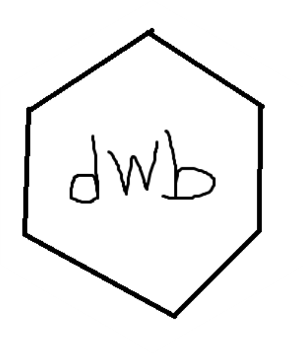

# dwb <a href="https://github.com/carlosdemoura/dwb"></a>

<!-- badges: start -->

<!-- badges: end -->

The goal of `dwb` is to facilitate the download of the check/build reports from the tool ["Building and checking R source packages for Windows"](https://win-builder.r-project.org/)

## Installation

You can install the development version of `dwb` like so:

``` r
# install.packages("devtools")
devtools::install_github("carlosdemoura/dwb")
```

## Example

The two examples bellow are equivalent, i.e., you can use as argument to `download_report()` either the full URL of the report or the 12 digits that identify it.

``` r
library(dwb)
download_report("https://win-builder.r-project.org/8esWmBov13K0")

download_report("8esWmBov13K0")
```
